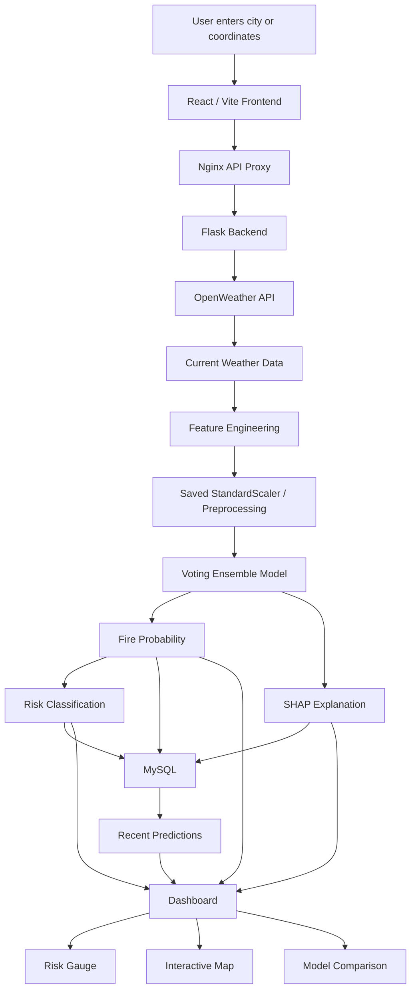

# Explainable Forest Fire Prediction and Risk Mapping System

An end-to-end machine learning application for predicting forest fire risk from current weather conditions, explaining each prediction with SHAP, storing prediction history in MySQL, and visualizing results on an interactive map.

## Live Demo

- Frontend: https://airy-tranquility-production-057c.up.railway.app
- Backend API: https://forest-fire-prediction-production-43d4.up.railway.app
- Health check: https://forest-fire-prediction-production-43d4.up.railway.app/api/health
- GitHub: https://github.com/Sachinyadav8896/forest-fire-prediction

## Project Overview

The system supports two major workflows:

1. **Model training and evaluation**
   - Loads the historical forest-fire dataset.
   - Cleans and preprocesses the data.
   - Engineers additional fire-risk features.
   - Trains and compares multiple machine learning models.
   - Selects the best model using evaluation metrics.
   - Saves the trained model and preprocessing artifacts.

2. **Live fire-risk prediction**
   - User enters a city or coordinates.
   - Current weather is retrieved from OpenWeather.
   - The same feature-engineering and preprocessing pipeline used during training is applied.
   - The trained Voting Ensemble predicts fire probability.
   - A risk category is assigned.
   - SHAP explains which features increased or decreased the prediction.
   - The result is persisted to MySQL and displayed on the dashboard.

## Main Features

- Current-weather fire-risk prediction using OpenWeather
- Offline weather fallback for supported cities
- Voting Ensemble prediction model
- Eight-model performance comparison
- SHAP-based local explainability
- Interactive Leaflet/OpenStreetMap risk map
- Recent prediction history
- MySQL persistence
- Risk categories from Low to Extreme
- Optional alert workflow
- Flask REST API
- React + Vite dashboard
- Docker support
- Railway deployment

## System Architecture



## Dataset

The training pipeline is based on the **UCI Forest Fires dataset**.

Official source:

https://archive.ics.uci.edu/dataset/162/forest+fires

The original dataset contains 517 observations from the Montesinho region of northeast Portugal and includes fire-weather and meteorological variables such as:

- FFMC
- DMC
- DC
- ISI
- Temperature
- Relative humidity
- Wind speed
- Rainfall
- Burned area

### Target Creation

The original `area` column is converted into a binary classification target:

```text
area = 0   -> fire_occurred = 0
area > 0   -> fire_occurred = 1
```

The project therefore treats prediction as a binary fire-occurrence classification problem.

## Model Features

The current trained model uses these nine features:

1. `temperature`
2. `humidity`
3. `wind_speed`
4. `rainfall`
5. `fire_weather_index`
6. `heat_index`
7. `temp_humidity_ratio`
8. `wind_risk_score`
9. `historical_fire_frequency`

Engineered features are created in:

```text
backend/utils/feature_engineering.py
```

## Models Trained

The training pipeline compares:

- Random Forest
- Extra Trees
- Gradient Boosting
- XGBoost
- LightGBM
- CatBoost
- Voting Ensemble
- Stacking Ensemble

The currently deployed best model is:

```text
VotingEnsemble
```

## Current Model Results

The saved `best_model_meta.json` reports:

| Metric | Value |
|---|---:|
| Accuracy | 63.73% |
| Precision | 63.69% |
| Recall | 63.73% |
| F1 Score | 63.40% |
| ROC-AUC | 67.21% |
| CV F1 Mean | 52.76% |
| CV F1 Std | 4.15% |
| False Negatives | 15 |
| Training Time | 1.50 s |
| Prediction Time | 0.237 s |

### Confusion Matrix

```text
                    Predicted
                 No Fire   Fire
Actual No Fire      26       22
Actual Fire         15       39
```

These metrics are generated by the training/evaluation pipeline, not entered manually.

## Explainable AI

The system uses SHAP to provide local explanations for each prediction.

A prediction response can include feature contributions such as:

```text
wind_speed             +0.151
temp_humidity_ratio    +0.070
fire_weather_index     +0.020
temperature            -0.031
```

Positive values push the prediction toward higher fire risk, while negative values push it toward lower fire risk.

## Weather Sources

### Primary: OpenWeather

When `OPENWEATHER_API_KEY` is configured, the backend retrieves current:

- Temperature
- Humidity
- Pressure
- Wind speed
- Rainfall
- Latitude / longitude

This allows the same city to produce different predictions as weather conditions change.

### Fallback: Offline Weather CSV

If no OpenWeather key is configured, the system can use:

```text
database/offline_weather.csv
```

This file contains predefined weather values for a limited set of cities.

## Technology Stack

### Machine Learning / Data

- Python
- pandas
- NumPy
- scikit-learn
- XGBoost
- LightGBM
- CatBoost
- imbalanced-learn / SMOTE
- SHAP
- joblib

### Backend

- Flask
- Gunicorn
- MySQL
- mysql-connector-python
- Requests
- Flask-CORS

### Frontend

- React
- Vite
- Tailwind CSS
- Axios
- React Leaflet
- Leaflet
- Recharts
- Nginx

### Deployment

- Docker
- Railway
- GitHub
- Railway MySQL

## Project Structure

```text
forest-fire-prediction/
|
|-- backend/
|   |-- api/
|   |   `-- routes.py
|   |-- training/
|   |   `-- train_models.py
|   |-- utils/
|   |   |-- db.py
|   |   |-- feature_engineering.py
|   |   |-- prediction_service.py
|   |   |-- preprocessing.py
|   |   |-- weather_service.py
|   |   `-- alert_service.py
|   |-- app.py
|   |-- Dockerfile
|   |-- Dockerfile.train
|   `-- requirements.txt
|
|-- config/
|   `-- config.py
|
|-- database/
|   |-- schema.sql
|   `-- offline_weather.csv
|
|-- dataset/
|   |-- raw/
|   `-- processed/
|
|-- frontend/
|   |-- src/
|   |   |-- components/
|   |   |-- pages/
|   |   `-- services/
|   |-- Dockerfile
|   |-- nginx.conf
|   `-- package.json
|
|-- models/
|   `-- saved/
|
|-- research/
|   |-- reports/
|   `-- shap/
|
|-- docker-compose.yml
|-- .env.example
|-- .dockerignore
|-- .gitignore
`-- README.md
```

## Environment Variables

Create a local `.env` file from `.env.example`.

```env
OPENWEATHER_API_KEY=your_openweather_api_key
NASA_FIRMS_API_KEY=

DB_HOST=localhost
DB_PORT=3306
DB_USER=root
DB_PASSWORD=your_mysql_password
DB_NAME=forest_fire_db

SMTP_HOST=
SMTP_PORT=587
SMTP_USER=
SMTP_PASSWORD=
ALERT_FROM_EMAIL=
```

Never commit your real `.env` file or API keys.

## Local Development

### 1. Clone the Repository

```bash
git clone https://github.com/Sachinyadav8896/forest-fire-prediction.git
cd forest-fire-prediction
```

### 2. Configure Environment Variables

Copy:

```text
.env.example
```

to:

```text
.env
```

and fill in your own credentials.

### 3. Initialize MySQL

Create the database schema:

```bash
mysql -u root -p < database/schema.sql
```

### 4. Start the Backend

PowerShell:

```powershell
cd backend
.\venv\Scripts\Activate.ps1
python app.py
```

Backend:

```text
http://127.0.0.1:5000
```

### 5. Start the Frontend

Open a second terminal:

```powershell
cd frontend
npm install
npm run dev
```

Frontend:

```text
http://localhost:5173
```

## Normal Startup Commands

Once dependencies are installed, the normal local startup is:

### Terminal 1

```powershell
cd backend
.\venv\Scripts\Activate.ps1
python app.py
```

### Terminal 2

```powershell
cd frontend
npm run dev
```

## Train the Models

Training is only required when changing the dataset, preprocessing, features, or models.

From the project root:

```powershell
.\backend\venv\Scripts\python.exe backend\training\train_models.py --data dataset\processed\fire_data_processed.csv
```

Training produces:

```text
models/saved/best_model.joblib
models/saved/best_model_meta.json
models/saved/preprocess_artifacts.joblib
models/saved/<model-name>.joblib
research/reports/model_comparison.csv
```

## REST API

| Method | Endpoint | Purpose |
|---|---|---|
| GET | `/api/health` | Backend health check |
| POST | `/api/predict` | Predict from supplied feature values |
| POST | `/api/predict/live` | Fetch weather and predict for a city or coordinates |
| GET | `/api/predictions/recent?limit=30` | Recent prediction history |
| GET | `/api/predictions/map` | Latest map predictions |
| GET | `/api/models/compare` | Model comparison results |
| GET | `/api/alerts/recent?limit=20` | Recent alerts |

### Example Live Prediction

Request:

```json
{
  "city_name": "Delhi"
}
```

Example response fields:

```json
{
  "model_name": "VotingEnsemble",
  "fire_probability": 0.67,
  "risk_level": "Very High",
  "top_features": [],
  "weather": {
    "city_name": "Delhi",
    "source": "openweather"
  }
}
```

Values change with current weather conditions.

## Risk Levels

The backend converts model probability into five risk categories:

```text
Low
Moderate
High
Very High
Extreme
```

The exact thresholds are defined in the backend configuration and feature-engineering/risk-classification logic.

## Database

The MySQL schema includes:

- `locations`
- `weather_snapshots`
- `predictions`
- `alerts`
- `model_metrics`
- `latest_predictions_by_location` view

Each successful prediction can store:

```text
Location
  |
Weather Snapshot
  |
Prediction
  |
Optional Alert
```

## Docker

The repository contains:

```text
docker-compose.yml
backend/Dockerfile
backend/Dockerfile.train
frontend/Dockerfile
frontend/nginx.conf
```

Typical local Docker workflow:

```bash
docker compose run --rm trainer
docker compose up -d --build
```

Default local endpoints:

```text
Frontend: http://localhost:8080
Backend:  http://localhost:5000
MySQL:    localhost:3306
```

## Railway Deployment

The deployed application uses three Railway services:

```text
Frontend
  |
  | private Railway network
  v
Backend
  |
  v
MySQL
```

### Frontend

```text
https://airy-tranquility-production-057c.up.railway.app
```

The frontend is built with Vite and served by Nginx.

### Backend

```text
https://forest-fire-prediction-production-43d4.up.railway.app
```

The backend runs Flask through Gunicorn.

### MySQL

Railway MySQL stores locations, weather snapshots, predictions, and alerts.

Secrets such as the OpenWeather API key and database password are stored in Railway environment variables rather than GitHub.

## Deployment Verification

Useful checks:

```text
GET /api/health
GET /api/models/compare
GET /api/predictions/recent
```

A complete production prediction follows:

```text
Browser
  -> Railway Frontend
  -> Nginx
  -> Railway Private Network
  -> Flask Backend
  -> OpenWeather
  -> Feature Engineering
  -> VotingEnsemble
  -> SHAP
  -> MySQL
  -> Dashboard
```

## Current Status

- [x] Data preparation
- [x] Feature engineering
- [x] Model training
- [x] Multi-model comparison
- [x] Voting Ensemble deployment
- [x] OpenWeather integration
- [x] Offline weather fallback
- [x] SHAP explanations
- [x] Flask API
- [x] MySQL persistence
- [x] Interactive map
- [x] Recent prediction history
- [x] Model comparison dashboard
- [x] Docker support
- [x] Railway deployment
- [x] Public frontend
- [x] Public backend

## Future Improvements

Possible extensions include:

- Historical trend charts
- Time-series fire-risk forecasting
- Additional regional datasets
- Satellite/NDVI data integration
- Better probability calibration
- Automated retraining
- Model monitoring
- SMS/email alert integrations
- User authentication
- PDF risk reports
- Custom production domain

## Security Notes

- Never commit `.env`.
- Never commit real API keys.
- Rotate a key immediately if it is accidentally exposed.
- Store production credentials in Railway variables.
- Use separate development and production database credentials where possible.

## Disclaimer

This project is an educational/research prototype. Fire-risk predictions should not be treated as an official emergency warning or as a substitute for information from local authorities, fire services, or professional environmental monitoring systems.
